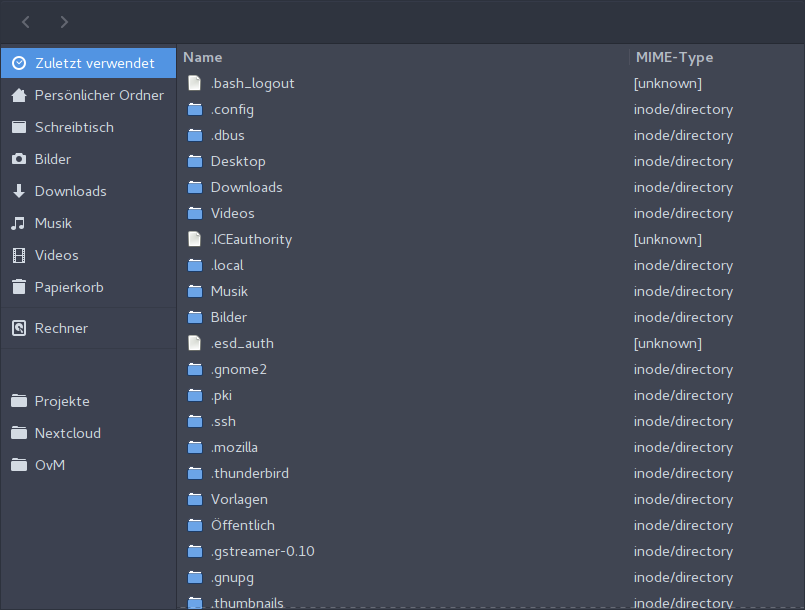

# mycelium

A gtk3 file manager written in Rust.

*This is pre-alpha software. You can't do anything with it yet!*

Here is a screenshot though, to give you a rough idea of how far along I am with the development.

## License

This project is licensed under the GNU General Public License Version 3.

See the [LICENSE](LICENSE) file for more details.